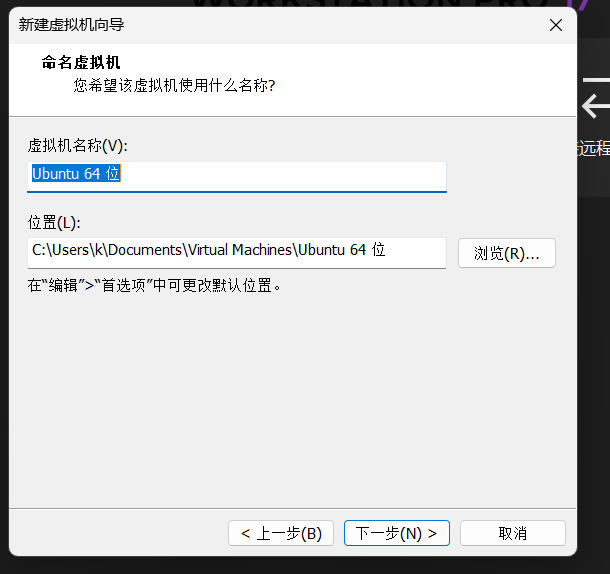

<h1 style="color:gray; opacity:0.6; filter:blur(1px);">
Lab0 实验介绍
</h1>

本实验介绍基本按照助教的实验文档完成。

主要有以下内容：

- 搭建 Ubuntu 22.04 虚拟机环境并下载本课程所需软件包
- 测试环境配置是否成功
- 使用 Git 维护代码版本并处理冲突
- 了解基本的 C++ STL(标准模版库) 使用
- 掌握大型 CMake 项目的 Debug 方法

    我采用的是助教没有详细讲解的VMware，采用原因是之前操作系统课程就是用的这个虚拟机，省去了不少时间下载。

    

## 1.下载虚拟机软件：

- VMWare：[Downloads – VMWare](https://www.vmware.com/products/desktop-hypervisor/workstation-and-fusion)

虚拟机软件的版本没有规定的要求，但必须满足基本需求。

下载 Ubuntu：

(x86)

请下载命名为 ubuntu-22.04.4-live-server-amd64（或 22.04.5） 的镜像文件

- 官网链接：[Ubuntu Releases](https://releases.ubuntu.com/)
- 科大镜像：[Index of /ubuntu-releases/ (ustc.edu.cn)](https://mirrors.ustc.edu.cn/ubuntu-releases/)
- 清华镜像：[Index of /ubuntu-releases/ | 清华大学开源软件镜像站 | Tsinghua Open Source Mirror](https://mirrors.tuna.tsinghua.edu.cn/ubuntu-releases/)

---

(arm)

请下载命名为 ubuntu-22.04.5-live-server-arm64 的镜像文件

- 科大镜像：[Index of /ubuntu-releases/ (ustc.edu.cn)](https://mirrors.ustc.edu.cn/ubuntu-cdimage/releases/22.04.5/release/)
- 清华镜像：[Index of /ubuntu-releases/ | 清华大学开源软件镜像站 | Tsinghua Open Source Mirror](https://mirrors.tuna.tsinghua.edu.cn/ubuntu-cdimage/releases/22.04.5/release/)

---

请按照需要的版本安装。

上面几个网站可能找不到ubuntu-22.04.4-live-server-amd64，可以自己找旧版本收集网站下载。

下载完成之后无需打开镜像文件，只需在后续导入虚拟机软件即可。

---

## 2.创建使用虚拟机

### 2.1创建

    创建虚拟机，点击加号即可创建。

<p align="center">
  
</p>

    然后默认选项推进。

<p align="center">
  
</p>

    导入刚才下载的iso文件就可以，然后下一步。

<p align="center">
  
</p>

    注意位置选择，因为虚拟机可能要很大的存储空间，请不要不加考虑的直接存在C盘中，本次实验的推荐存储是25~40G。我选择的是我的移动硬盘。

<p align="center">
  
</p>

    本次实验的推荐存储是25~40G。

    之后默认选项直接完成即可。

### 2.2使用

    请阅读[Lab0 简介 - USTC 编译原理和技术 2025](https://ustc-compiler-2025.github.io/homepage/lab0/)

    我只补充一下文档中没有的内容，请谅解。

    补充的内容是VMware的ssh连接，

    Nat设置可以在虚拟机的设置-网络适配器找到。

    端口转发需要在另一个地方找。

    首先编辑-虚拟网络编辑器，打开**虚拟网络编辑器**


    然后找到NAT连接的网络，需要注意有管理员权限才能修改网络配置，按钮是灰色的点一下下面的更改i设置。

    然后点开NAT设置。


        添加对应的端口转发类型，linux虚拟机的ssh端口默认是22，所以我们使用22作为端口。

        虚拟机ip可以通过下面的指令得到。

```bash
ip addr
```


这样就完成了端口转发设置，其余内容请参考实验文档。

软件环境配置可以采用vscode的ssh连接直接完成。

---

## 3.VScode中涉及cmake&&cmake tools插件的补充

    同理，这里是我遇到的问题的补充。实验讲解请到实验文档查看。

    当在下载cmake之后，我并没有弹工具链。在实验文档中，我们被要求使用

> Ctrl + Shift + P

    调出命令窗口后使用，

> CMake: Select a Kit

    但是如果你发现你找不到这个命令的时候，就说明你和我遇到了同样的问题。

    同时，你也找不到

> CMake: Scan for Kits

    这个扫描工具库的命令。

   这是因为你没有选择Cmakelist.txt文件,可以使用

> CMake:Show Configure Command

    选择你要选中的Cmakelist.txt文件，这样问题就解决了。

    可以先clone的测试工程然后选中测试工程的Cmakelist.txt文件。


## 4.关于运行时报运行的文件和选择的文件不是同一个的错误

    可以采取打开文件/文件夹的方式解决。

    当然你可以重新退了连接。

    

    也可以采用上面这个转到文件的命令来转到你想要的文件。

    其余的在本次实验至少是没卡到我。
